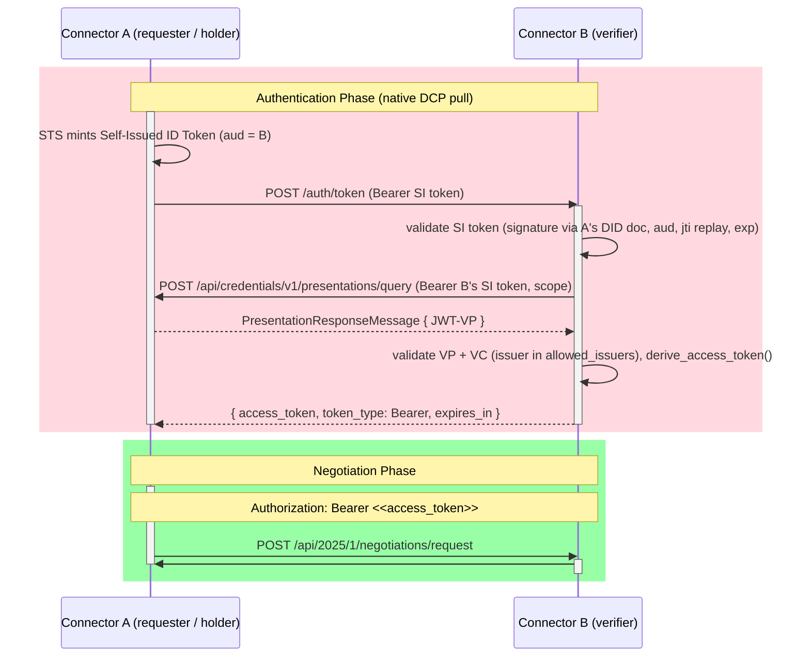

# Native DCP authentication protocol

The sequence diagram below illustrates the connector's built-in authentication — a
native implementation of the [Decentralized Claims Protocol](https://eclipse-dataspace-dcp.github.io/decentralized-claims-protocol/v1.0.1/).
Each connector is its own issuer, holder, and verifier behind a single `did:web`;
there is no external wallet or verifier service. Token exchange is a synchronous
**pull** — no session, no polling.

