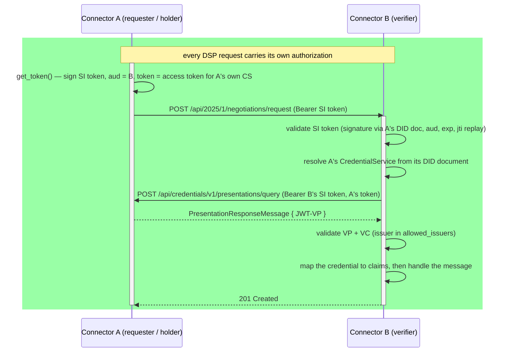

# Native DCP authentication

This connector implements the
[Decentralized Claims Protocol](https://eclipse-dataspace-dcp.github.io/decentralized-claims-protocol/v1.0.1/)
natively. Each connector is its own holder and verifier — and, for self-issued
credentials, its own issuer — behind a single `did:web`. There is no external
wallet or verifier service.

Authorization travels **on the protocol request itself**. The requester signs a
Self-Issued ID Token and sends it as the DSP request's bearer; the verifier validates it
and reaches back into the requester's Credential Service to fetch a presentation. One
synchronous pull, no session and no polling.

`POST /auth/token` performs the same exchange up front and hands back a DSP access token.
It is kept for callers that want a token before making protocol requests, but nothing in
the protocol path uses it — and no other implementation would call it.

`Authenticator` (`mod.rs`) owns the wallet and is a concrete type — there is one
implementation, so there is no backend trait and nothing downcasts in the request
path. `Authenticator::authenticate` is the inbound entry point, used by the extractor
every DSP handler shares (`extractor.rs`); `token.rs` is the `/auth/token` handler over
the same verifier. The DCP primitives they build on live in `../wallet/dcp/`.



## Where the SI token comes from

`Authenticator::get_token` mints the Self-Issued ID Token **in process** via
`build_si_token`, and embeds a second token in its `token` claim — an access token
addressed to this connector's own Credential Service, which the verifier presents when it
pulls the presentation. The Secure Token Service (`../wallet/dcp/sts.rs`) is *not* on this
path — nothing in the protocol calls it. It exists so an operator or an external client
can mint a token by hand, which is why it is opt-in (`wallet.sts_client_id` /
`wallet.sts_client_secret`, no defaults) and mounted at
`POST /api-internal/sts/token` rather than on a public path.

## Layering

```
connector  ->  auth  ->  wallet  ->  shared
```

`wallet` depends only on `shared` (`KeyPair`, DID-document types, did:web helpers)
and external crates — never on `connector` or `auth`. A test in `wallet/mod.rs`
enforces this, so lifting the wallet into its own crate or process stays a move
rather than a redesign.
