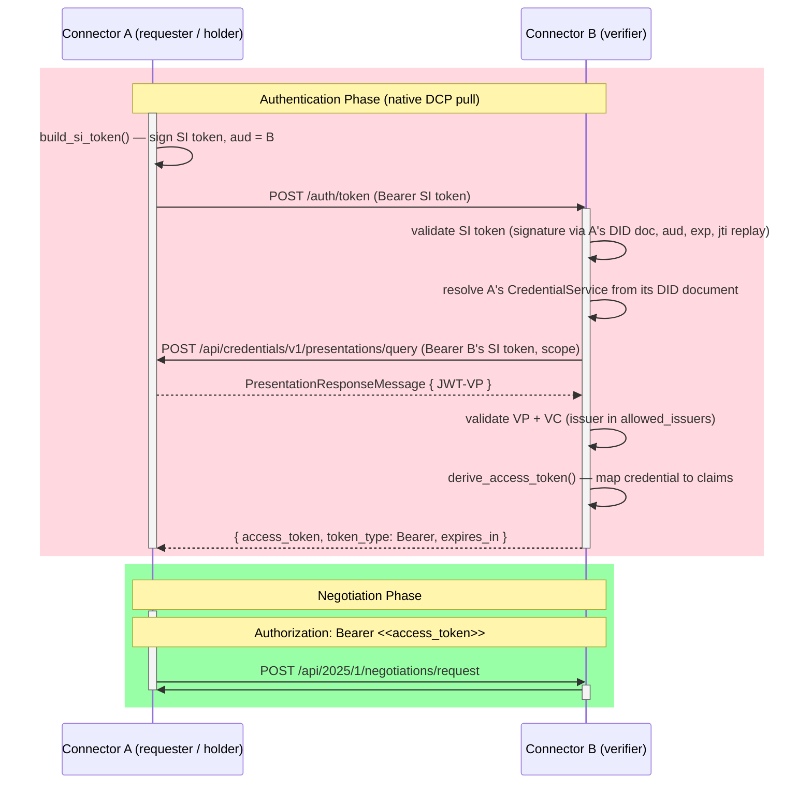

# Native DCP authentication

This connector implements the
[Decentralized Claims Protocol](https://eclipse-dataspace-dcp.github.io/decentralized-claims-protocol/v1.0.1/)
natively. Each connector is its own holder and verifier — and, for self-issued
credentials, its own issuer — behind a single `did:web`. There is no external
wallet or verifier service.

Token exchange is a synchronous **pull**: no session, no polling. The verifier
reaches back into the requester's Credential Service to fetch a presentation.

`Authenticator` (`mod.rs`) owns the wallet and is a concrete type — there is one
implementation, so there is no backend trait and nothing downcasts in the request
path. The inbound verifier handler lives in `token.rs`; the DCP primitives it
builds on live in `../dcp/`.



## Where the SI token comes from

`Authenticator::get_token` mints the Self-Issued ID Token **in process** via
`build_si_token`. The Secure Token Service (`../dcp/sts.rs`) is *not* on this path
— nothing in the protocol calls it. It exists so an operator or an external client
can mint a token by hand, which is why it is opt-in (`dcp.sts_client_id` /
`dcp.sts_client_secret`, no defaults) and mounted at
`POST /api-internal/sts/token` rather than on a public path.

## Layering

```
connector  ->  auth  ->  dcp  ->  shared
```

`dcp` depends only on `shared` (`KeyPair`, DID-document types, did:web helpers)
and external crates — never on `connector` or `auth`. A test in `dcp/mod.rs`
enforces this, so lifting the wallet into its own crate or process stays a move
rather than a redesign.
